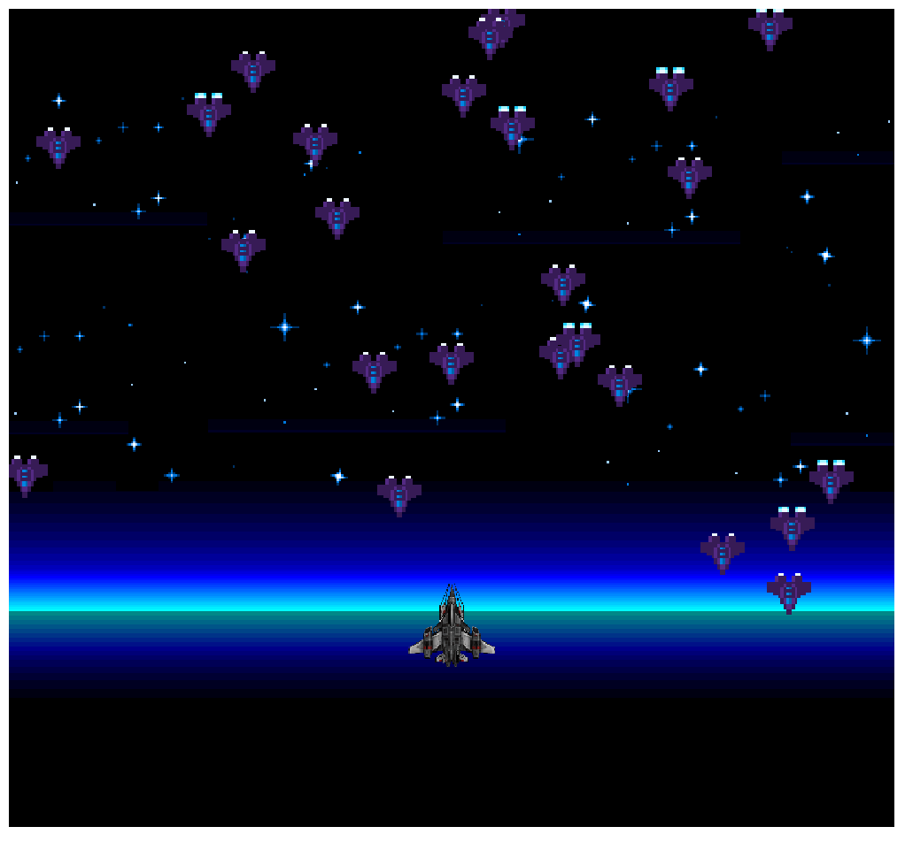
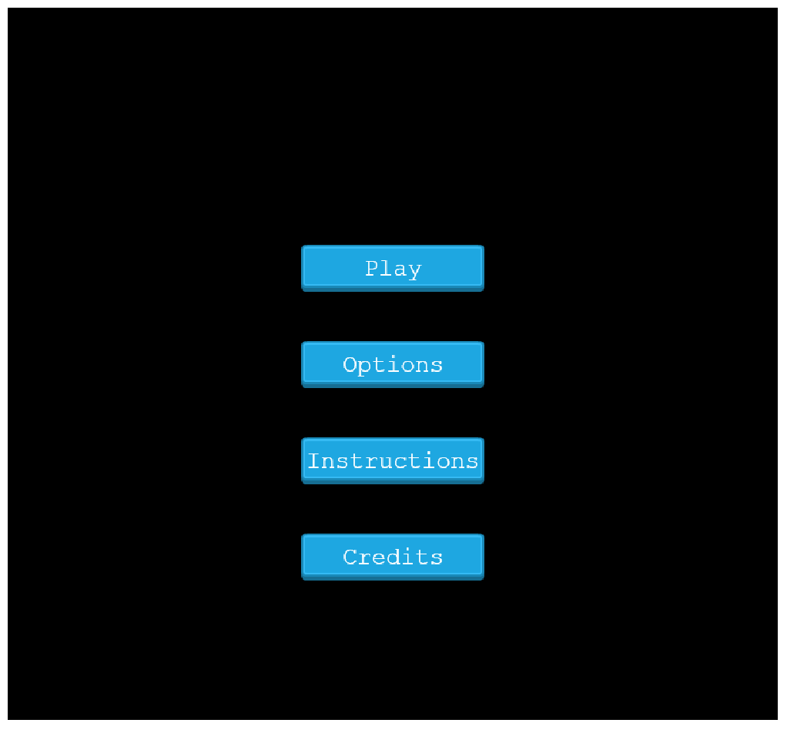

# Space Battle - Shooter Game with Phaser 3


## About the project:

In this project, I built a Shooter game with Phaser 3
This project project was built following the specifications , and user stories given by Microverse.
[Read the projects specifications](https://www.notion.so/Shooter-game-203e819041c7486bb36f9e65faecba27)

## Built with:

  <a href="https://developer.mozilla.org/en-US/docs/Web/JavaScript"></a>
  <a href="https://github.com/"></a>
  <a href="#"></a>
  <a href="#"></a>
  <a href="#"></a>
  <a href="#"></a>
  <br>

## Table of content:

- [About the project](#about-the-project)
- [Live demo](#Live-demoh)
- [Built with](#built-with)
- [Screenshots](#Screenshotsh)
- [Dependencies](#dependencies)
- [Linting tools:](#Linting-tools)
- [Getting started](#getting-started)
- [Deployment](#deployment)
- [Author](#author)
- [Contributing](#contributing)
- [Acknowledgments](#acknowledgments)
- [License](#License)

## Live demo
[Link to the deployed app](https://60524c2aedf7ea1d363c30eb--keen-galileo-e2a377.netlify.app/)

## Screenshots


<br>
<span> </span>
<br>

## Dependencies:

Iportant Gems and dependencies used in this web application:

<table>
  <tr>
    <th>Dependency</th>
    <th>for</th>
    <th>Development</th>
    <th>Test</th>
    <th>Production</th>
  </tr>
  <tr>
    <td>Webpack</td>
    <td>Bundler and compiler</td>
    <td>⭐️</td>
    <td></td>
    <td></td>
  </tr>
    <tr>
    <td>file-loader</td>
    <td>Assets management</td>
    <td>⭐️</td>
    <td></td>
    <td></td>
  </tr>
  <tr>
    <td>style-loader</td>
    <td>Assets management</td>
    <td>⭐️</td>
    <td></td>
    <td></td>
  </tr>
  <tr>
    <td>stylelint</td>
    <td>Css linter</td>
    <td>⭐️</td>
    <td></td>
    <td></td>
  </tr>
  <tr>
    <td>eslint</td>
    <td>Javascript linter</td>
    <td>⭐️</td>
    <td></td>
    <td></td>
  </tr>
  
</table>

## Linting tools:

<table>
  <tr>
    <th>Linter</th>
    <th>Use</th>
    <th>Files</th>
  </tr>
  <tr>
    <td>eslintrc</td>
    <td>Linting Javascript files</td>
    <td>.js</td>
  </tr>
    <tr>
    <td>Stylelint</td>
    <td>Linting styling errors</td>
    <td>.css .scss</td>
  </tr>
</table>

## Getting started (Development)

To get a local copy of the repository please run the following commands on your terminal:

```
$ git clone git@github.com:CalyCherkaoui/shooter-game-space-battle.git
$ cd shooter-game-space-battle
$ git branch feature
$ git checkout feature
$ npm install
$ npm run build
$ npm start
```

To lint your Js code:
```
$ npx eslint . --fix
```

## Author

👤 **Houda Cherkaoui**

- Github: [@CalyCherkaoui](https://github.com/CalyCherkaoui)
- Twitter: [@Houda59579688](https://twitter.com/Houda59579688)
- Linkedin: [Houda-Cherkaoui](https://www.linkedin.com/in/houda-cherkaoui-64106395/)


## 🤝 Contributing

Contributions, issues and feature requests are welcome!

## Show your support

Give a ⭐️ if you like this project!

## Acknowledgments
- [Phaser 3](https://phaser.io)
- [Build a Space Shooter with Phaser 3 Tutorial by Jared](https://learn.yorkcs.com/category/tutorials/gamedev/phaser-3/build-a-space-shooter-with-phaser-3/)
- [Creating a Phaser 3 Template Tutorial](https://phasertutorials.com/creating-a-phaser-3-template-part-1/)
- Hat tip to [stackoverflow](https://stackoverflow.com) comunity.
- Hat tip to [Microverse](https://www.microverse.org/) TSE for Code Review.
- Hat tip to anyone whose code was used

## 📝 License

All source codeis available jointly under the MIT License.
See [MIT licence](./LICENSE) for details.